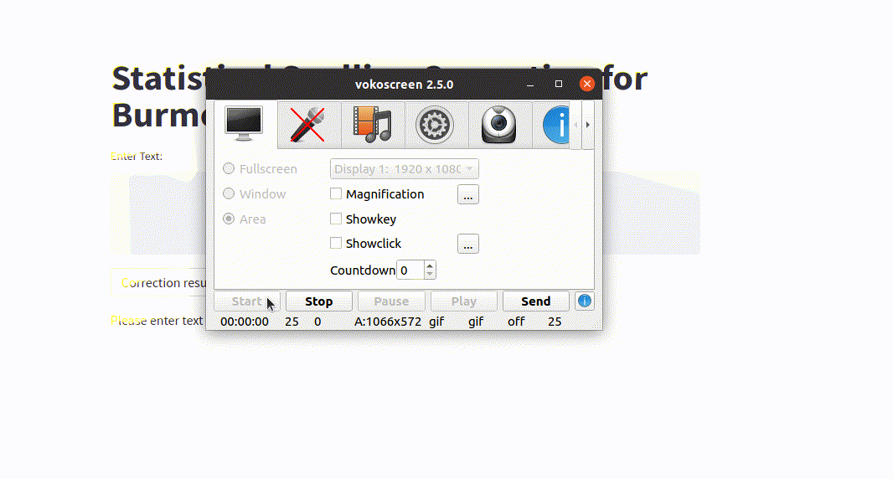

# Spelling Correction for Burmese Language using Statistical Methods

**Author : Thura Aung**

ReadME in Myanmar Language : https://github.com/ThuraAung1601/mySpellCorrect/blob/main/myanmarREADME.md

Spelling Correction mini-project is one of my pet projects. Here, I am using Statistical approaches such as ngram and SymSpell rather than Ruled-based.

It is not the first use of SymSpell for Myanmar (မြန်မာ) Language. There is a systematically researched conference paper entitled SymSpell4Burmese[3]. Therefore, this would be unofficial implementation of SymSpell4Burmese.

We can correct alphabet errors like ( ကြက်ဉ -> ကြက်ဥ ). But some of the most common spelling errors are not corrected yet. That might happen because of the dictionary I used.

Dictionaries were built from ​myPOS ver3.0 [4] using myWord[5] tool. myPOS was collected from various domain and there might be some noise (common spelling errors) because the main purpose of the corpus was to tag POSTags correctly on the language we used as daily basis.

Dictionaries with correct spellings especially for alphabets and phonetic errors will help alot.

There are also common spelling errors apart from the standard intentionally.
eg. သယ်ရင်း -> သူငယ်ချင်း

Also typo errors
eg. မှ ူးမတ်​​ငေနာပတိ -> မှူးမတ်​သေနာပတိ

For them, deep learning approach is needed.[6]

If you want to use mySpell directly as I programmed, Myanmar sentences should be word-segmented.

## Usage

Install requirements

```{r, engine='bash', count_lines}
pip install -r requirements.txt
```

If you want to correct the whole corpus

```{r, engine='bash', count_lines}
python ./mySpellCorrect.py -i test.txt
```

check the parameters using help command

```{r, engine='bash', count_lines}
python mySpellCorrect.py -h
usage: mySpellCorrect.py [-h] [-cp CORPUS] [-ut UNIGRAM_DICT] [-bt BIGRAM_DICT] [-i INPUT] [-o OUTPUT] [-m MODE]

Statistical Spelling Correction for Burmese language

optional arguments:
  -h, --help            show this help message and exit
  -cp CORPUS, --corpus CORPUS
                        corpus file for n-gram
  -ut UNIGRAM_DICT, --unigram_dict UNIGRAM_DICT
                        unigram frequency dictionary file
  -bt BIGRAM_DICT, --bigram_dict BIGRAM_DICT
                        bigram frequency dictionary file
  -i INPUT, --input INPUT
                        input file
  -o OUTPUT, --output OUTPUT
                        output file
  -m MODE, --mode MODE  s for symspell and n for n-gram spelling correction
```

You can also import to other programs as below:

```{r, engine='bash', count_lines}
from mySpellCheck import ngramSpell
sentence = "မ ဟုတ် ဘူးး"
ngramSpell(sentence)

>> ['မ ဟုတ် ဘူး']
```
```{r, engine='bash', count_lines}
from mySpellCheck import mySymSpell
sentence = "မ ဟုတ် ဘူးး"
mySymSpell(sentence)

>> ['မ ဟုတ် ဘူး']
```

GUI Demonstration is also available ...

```{r, engine='bash', count_lines}
streamlit run gui.py
```
I used streamlit for GUI demonstration.

## Demo


## Citation
### Notice that all of the data I have used are not my property and please check the Licenses

If you want to use any data or dictionary under ./data folder in your research and we'd appreciate if you use the following three references:

- Khin War War Htike, Ye Kyaw Thu, Zuping Zhang, Win Pa Pa, Yoshinori Sagisaka and Naoto Iwahashi, "Comparison of Six POS Tagging Methods on 10K Sentences Myanmar Language (Burmese) POS Tagged Corpus", at 18th International Conference on Computational Linguistics and Intelligent Text Processing (CICLing 2017), April 17~23, 2017, Budapest, Hungary.*
- Zar Zar Hlaing, Ye Kyaw Thu, Myat Myo Nwe Wai, Thepchai Supnithi, Ponrudee Netisopakul, "Myanmar POS resource extension effects on automatic tagging methods", In Proceedings of the 15th International Joint Symposium on Artificial Intelligence and Natural Language Processing (iSAI-NLP 2020), Nov 18 to Nov 20, 2020, Bangkok, Thailand, pp. 189-194.*
- myWord: Syllable, Word and Phrase Segmenter for Burmese, Ye Kyaw Thu, Sept 2021, GitHub Link: https://github.com/ye-kyaw-thu/myWord**

## References:

- [1] Vacláv Chvátal and David Sankoff. "Longest common subsequences of two random sequences", 1975. Journal of Applied Probability, Python module: ngram (https://pypi.org/project/ngram/).

- [2] Wolf Garbe <wolf.garbe@faroo.com> Description: https://medium.com/@wolfgarbe/1000x-faster-spelling-correction-algorithm-2012-8701fcd87a5f .URL: https://github.com/wolfgarbe/symspell .Python module: symspellpy (https://github.com/mammothb/symspellpy)

- [3] Mon, Ei & Kyaw Thu, Ye & Yu, Than & Oo, Aye. (2021). SymSpell4Burmese: Symmetric Delete Spelling Correction Algorithm (SymSpell) for Burmese Spelling Checking. 1-6. 10.1109/iSAI-NLP54397.2021.9678171. 

- [4] Zar Zar Hlaing, Ye Kyaw Thu, Myat Myo Nwe Wai, Thepchai Supnithi, Ponrudee Netisopakul, "Myanmar POS resource extension effects on automatic tagging methods", In Proceedings of the 15th International Joint Symposium on Artificial Intelligence and Natural Language Processing (iSAI-NLP 2020), Nov 18 to Nov 20, 2020, Bangkok, Thailand, pp. 189-194.*

- [5] myWord: Syllable, Word and Phrase Segmenter for Burmese, Ye Kyaw Thu, Sept 2021, GitHub Link: https://github.com/ye-kyaw-thu/myWord**

- [6] https://bhashkarkunal.medium.com/spelling-correction-using-deep-learning-how-bi-directional-lstm-with-attention-flow-works-in-366fabcc7a2f

\* I used myPOS ver3 (without POS-tags) for building dictionaries

\** built dictionaries using myWord tool
